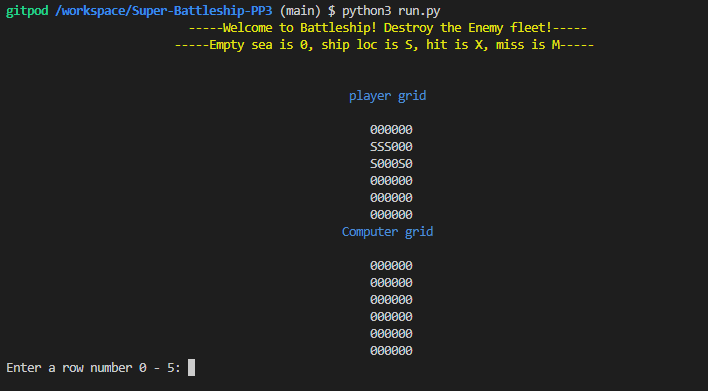
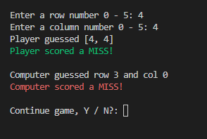
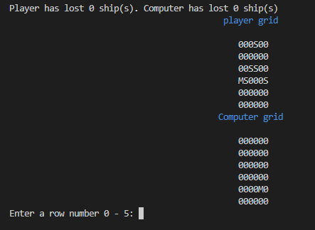
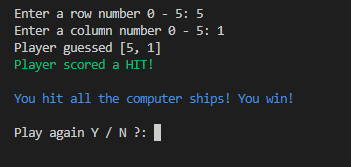
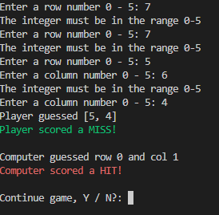
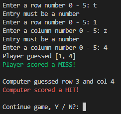
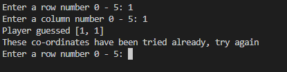

# BattleShips ! 
This game is based on the famous battleships game that originated on paper, then migrated to boards and now to PC screens. In this version, a human player plays against the computer. Both players have a board , on the human player board the ship positions are printed to the screen while on the computer board the ship positions remain hidden to the human player. 
A ship is denoted on the board with an 'S', a hit on a ship is denoted with an 'X' while a miss is denoted with a 'M'. Empty sea / available guesses are denoted by '0' for the human player, all board locations for the computer are denoted with 'O' until there is either a hit or a miss. 
Ship positions for both players are randomly generated, each ship takes up one location on the board. 

### Screen at game startup

## Game Play
At start up the player is presented with 2 boards. The player board will show ship positions while the computer board will not. The player is then prompted to enter a row. The entry must be a number between 0 and 5. Once the player has entered a valid row number the player is then prompted to enter a column number number. The player guess is printed to the screen. The game then checks to see if the player has scored a hit or missed the computers ships and outputs the outcome to the screen in Green text. 
The computer then makes a random guess, the guess is printed to the screen and the game will check the computer's guess against the players ship positions and advise if the computer hit or missed the players ships. The computer result is printed in Red text. 

The player is prompted to continue the game or not, if the player exitis then the game will print the current score and exit the game. Assuming the player selects 'Y' and continues , the game updates the boards with the hits / misses and reprints the boards at the top of the screen. The player is again prompted to enter a row / column until such tiome as the player exits or 5 ships have been destroyed for either player.

On completion of the game, a message will print informing the player as to has won this time. 

The game allows :
* Take user input and check to see if enemy ships are hit
* Play against a computer
* Provides feedback with respect to the ongoing score

### Input Validation -Error checking
The game requires that the player enters a number between 0 and 5. If the player tries to enter a number outside the range an error message appears and the player is prompted to try again. 

The game requires that the player enters a number and not a letter. 

The game requires that the player can't enter the same co-ordinates twice, also, the computer cannot randomly use the same the co-ordinates twice

## Data Model
The game uses a class called GridBuilder. There are two instances of the class called PlayerBoard and computerBoard. The class maintains the state of each of the above objects and creates and prints the boards and places the players / computers ships on the respective board. 
The class also stores the guesses made against each of the boards.

A function called Main is used to initiate - kick off the game and a second function called playGame controls the game loop. 

## Testing
* On startup , a welcome message prints in blue text - passed.
* On startup - the playerboard prints with 5 ship locations marked 'S' - passed.
* On startup - the computer board prints with all locations marked '0' - passed. 
* On startup, message and borads are centered in the terminal - passed.
* Player is prompted to enter a row - passed.
* Row must be a number , enter a letter to test, message if not a number - passed.
* Row must be between 0 and 5, enter large number to test, message if out of scope - passed. 
* Column must be a number as per row - passed
* Column must be between 0 - 5 as per row, passed.
* If user entry already tried, prompt to try again - passed.
* Prompt with same co-ordinates multiple times - passed.
* If user entry already tried, not added again to guesses list - passed.
* Computer generates a random guess - passed.
* Games reports Hits and misses for the player / computer - passed. 
* Game prompts the player to keep playing or quit - passed.
* If 'N' selected game prints score and exits - passed. 
* If 'Y' selected, screen clears, score prints and game boards reprint - passed. 
* Game refreshes scores after each round - passed. 
* Game restarts each round with score at top of screen and reprinted game boards - passed. 
* When a MISS is registered , appropriate cell changes to 'M' - passed.
* When a hit is registered , appropriate cell changes to 'X' - passed. 
* When 5 ships for either player of computer are achieved - win message is printed - pass. 
* Ctrl - c exits the game immediately - passed. 
* Test player guesses stored correctly - passed ( player will not see these)
* Test computer guesses stored correcty - passed (player will not see these)
* Test 5 ships generated for the player - passed.
* Test 5 ships generated for the computer - passed (player will not see these)

### Bugs
#### Solved Bugs
* Initially my co-ordinate selections were blowing up my own ships ! Fixed by passing computerboard object and player guess to class method.
* If the player selected the same co-ordinates more than twice the game crashed with an error. Fixed by implementing a while loop.
* Initially, both player and computer boards displayed ship positions, this worked well for early stages to enable game debugging, corrected so that computer board does not display ship positions.

### Remaining Bugs
N/A , none known

### Validator Testing
The code was passed through the CI Python Linter app. All PEP8 corrections were made with the following exceptions;
Results:
146: E501 line too long (98 > 79 characters)
147: E501 line too long (103 > 79 characters)
175: E501 line too long (86 > 79 characters)
176: E501 line too long (81 > 79 characters)
181: E501 line too long (81 > 79 characters)
187: E501 line too long (84 > 79 characters)
190: E501 line too long (80 > 79 characters)
191: E501 line too long (92 > 79 characters)
206: E501 line too long (114 > 79 characters)
209: E501 line too long (114 > 79 characters)
216: E501 line too long (81 > 79 characters)
The above output is caused primarily by variable naming / sizing for clarity and printing feedback to the screen. As the game functions well, will not correct these at this point. 

## Future Enhancements
* Add sound when player shots and computer shots are fired. I succedded in doing this using the Spyder IDE with local file storage however, I was unable to play sound files stored in the github repository.
* Prompt player for number of ships, this version the number of ships is constant at 5.
* Prompt player for name, this version the player is called 'Player'.
* Add multi size ships with different orientations.
* Introduce a time element i.e. the enemy ships may move across the grid and escape if not destroyed in time.

## Credits
* https://www.pythonmorsels.com/breaking-long-lines-code-python/  Python Morsels.
* https://www.geeksforgeeks.org/python-programming-language/  Geeks for Geeks.
* https://www.codecademy.com The code Academy
* https://linuxhint.com/play_sound_python/  Play sound with Python
* The Python Bible, 7 in 1 - Florian Dedov
* Python for Everybody, Charles Severance
* The self taught programmer, Cory Althoff

## Creating the Heroku app

When you create the app, you will need to add two buildpacks from the _Settings_ tab. The ordering is as follows:

1. `heroku/python`
2. `heroku/nodejs`

You must then create a _Config Var_ called `PORT`. Set this to `8000`

If you have credentials, such as in the Love Sandwiches project, you must create another _Config Var_ called `CREDS` and paste the JSON into the value field.

Connect your GitHub repository and deploy as normal.

## Constraints

The deployment terminal is set to 80 columns by 24 rows. That means that each line of text needs to be 80 characters or less otherwise it will be wrapped onto a second line.

-----
Happy coding!